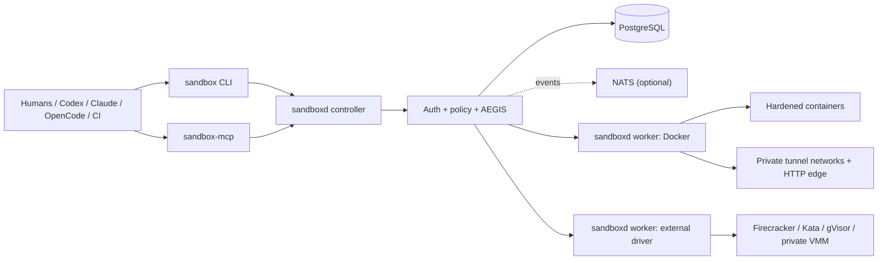

<div align="center">

```text
███████╗ █████╗ ███╗   ██╗██████╗ ██████╗  ██████╗ ██╗  ██╗
██╔════╝██╔══██╗████╗  ██║██╔══██╗██╔══██╗██╔═══██╗╚██╗██╔╝
███████╗███████║██╔██╗ ██║██║  ██║██████╔╝██║   ██║ ╚███╔╝
╚════██║██╔══██║██║╚██╗██║██║  ██║██╔══██╗██║   ██║ ██╔██╗
███████║██║  ██║██║ ╚████║██████╔╝██████╔╝╚██████╔╝██╔╝ ██╗
╚══════╝╚═╝  ╚═╝╚═╝  ╚═══╝╚═════╝ ╚═════╝  ╚═════╝ ╚═╝  ╚═╝
```

### Burn the code. Keep the host.

**A self-hosted Rust control plane for disposable coding environments and AI agents.**

[Architecture](docs/architecture.md) · [Security](docs/security.md) · [Server setup](docs/how-to-setup/server.md) · [Client setup](docs/how-to-setup/client.md) · [Custom domains](docs/how-to-setup/custom-public-domains.md) · [CLI](docs/cli.md) · [MCP](docs/mcp.md)

</div>

## One-command workstation setup

Install `sandbox`, `sandboxd`, `sandbox-mcp`, the Sandbox skill across supported agents, and register the MCP server with detected Codex, Claude Code, and Gemini CLIs:

```sh
curl -fsSL https://tools.yshubham.com/sandbox/setup.sh | sh
```

The full setup uses `npx` to install the skill across supported coding agents. For binaries only:

```sh
curl -fsSL https://tools.yshubham.com/sandbox/install.sh | sh
sandbox --help
```

The initial registry build publishes macOS ARM64 and Linux x86-64. The release workflow covers macOS x86-64 and Linux ARM64 as additional builders become available. Release binaries bundle `libpq` and vendored OpenSSL so `sandboxd` does not depend on a machine-specific PostgreSQL client path.

Then point the client at your self-hosted controller:

```sh
export SANDBOX_URL=https://sandbox.example.com
export SANDBOX_TOKEN='read-from-your-secret-store'
sandbox doctor
```

See [server setup](docs/how-to-setup/server.md), [client setup](docs/how-to-setup/client.md), [custom public domains](docs/how-to-setup/custom-public-domains.md), [MCP setup](docs/mcp.md), and the registry-hosted [`sandbox-platform` skill](https://github.com/bas3line/rool-repo/tree/main/skills/sandbox-platform).

Hosted documentation is available as a [human portal](https://tools.yshubham.com/docs/sandbox/), a raw [agent index](https://tools.yshubham.com/docs/sandbox/index.md), and an [`llms.txt`](https://tools.yshubham.com/docs/sandbox/llms.txt) discovery file.

The MCP guide includes native setup for Codex, Claude Code, Gemini CLI, OpenCode, VS Code/Copilot, and Goose, plus drop-in templates for Cursor, Claude Desktop, Windsurf, Cline, Roo Code, Gemini Code Assist, and generic MCP clients. Agents without native MCP support use the same `sandbox` CLI and installed skill.

## Why I am open-sourcing this

Sandbox started as private infrastructure I built to give coding agents fast, disposable machines without handing them the host. I kept running into the same problem: every team building with agents eventually needs remote execution, lifecycle management, resource limits, and a clean way to destroy everything afterward.

I am open-sourcing it so other engineers can use the foundation, adapt it to their own infrastructure, and help push self-hosted agent sandboxes forward. It is opinionated, practical, and still evolving—but it is real software, built to be run, forked, broken, improved, and shared.

Sandbox gives every human, CI job, and coding agent a typed remote execution boundary. One daemon, `sandboxd`, runs as a controller, worker, or both. The tiny `sandbox` CLI and `sandbox-mcp` bridge use the same authenticated API. PostgreSQL provides durable state; NATS is optional; Redis is deliberately not required. The default control plane stays lean.

```sh
sandbox create --tenant platform --image ubuntu:24.04 \
  --cpu-millis 2000 --memory-mib 4096 --ttl 3600 \
  --network restricted --untrusted-repo --generated-code

sandbox exec 019f... -- cargo test --workspace
sandbox tunnel create 019f... --port 3000
sandbox agent run codex --tenant platform
sandbox delete 019f... --wait
```

## What is already real

| Capability | Status |
|---|---|
| Controller/worker scheduling, leases, heartbeats, TTL cleanup | Implemented |
| AEGIS risk scoring and placement | Implemented and unit tested |
| Hardened Docker worker | Implemented; intended for dedicated single-tenant worker hosts |
| External runtime protocol for Firecracker, Kata, gVisor, or private VMMs | Implemented adapter contract; bring a driver |
| PostgreSQL through Diesel + in-memory development store | Implemented |
| NATS lifecycle events + zero-service in-memory bus | Implemented |
| CLI lifecycle, agent profiles, JSON output, bounded exec | Implemented |
| MCP 2025-11-25 stdio server with structured tool results | Implemented |
| Wildcard HTTP/WebSocket tunnels with per-sandbox edge networks | Implemented; custom HTTPS domains, direct edge, and Cloudflare ingress documented |
| Codex, Claude Code, OpenCode, Pi image builder | Implemented with pinned versions |
| Aider and Goose profiles | Implemented using their official images |
| OIDC/SAML, tenant RBAC, secret broker, interactive PTY, raw TCP tunnels | Design boundary; not implemented in v0.1 |

This repository is an engineering foundation, not a magic claim that Docker equals a hardened multi-tenant VM. Read the [security model](docs/security.md) before exposing it to hostile tenants.

## AEGIS: the custom isolation algorithm

AEGIS—**Adaptive Execution Guard and Isolation Scheduler**—does two jobs in one deterministic pass:

1. Scores workload risk from data sensitivity, network access, repository trust, generated-code execution, secret use, host mounts, exposure, privilege, and lifetime.
2. Chooses the minimum isolation tier, hard-filters unsafe nodes, then ranks survivors using dominant-resource headroom, fragmentation, host pressure, image warmth, region locality, and bin-packing efficiency.

A high-risk request cannot downgrade itself to a container. If no compatible microVM worker exists, the request fails with `no_capacity`; it never silently weakens isolation. See [docs/aegis.md](docs/aegis.md).

## The shape



`sandboxd` is one deployable executable. Split controller and worker processes for production blast-radius control; use `--role all` only for development or a dedicated single-node installation.

## Five-minute developer launch

Requirements: Docker with Compose and two random tokens of at least 32 characters.

```sh
export SANDBOX_API_TOKEN="$(openssl rand -hex 32)"
export SANDBOX_NODE_TOKEN="$(openssl rand -hex 32)"
docker compose -f deploy/compose/compose.yaml up --build
```

In another terminal:

```sh
export SANDBOX_URL=http://127.0.0.1:8080
export SANDBOX_TOKEN="$SANDBOX_API_TOKEN"
cargo run --package sandbox-cli -- doctor
cargo run --package sandbox-cli -- create --tenant dev --image ubuntu:24.04 --ttl 900
```

The Compose stack intentionally sets the microVM threshold above the score range so it can run on a normal Docker laptop. That is a developer convenience, not the production policy. Production keeps the default threshold of `55` and supplies compatible workers.

To publish sandbox services, configure wildcard DNS and enable an edge profile. Direct Traefik, Caddy, proxied Cloudflare with Origin CA and Full (strict), an outbound-only Cloudflare Tunnel overlay, and a clearly marked HTTP compatibility mode are documented in [docs/tunnels.md](docs/tunnels.md). Follow the [custom-domain setup](docs/how-to-setup/custom-public-domains.md) for the complete path. The outbound Cloudflare option keeps the origin off public ingress; real deployment domains, connector tokens, addresses, and certificate material belong in the environment or secret store, never the repository.

## Coding agents

Pinned image builders are included for:

```sh
./scripts/build-agent-image.sh codex
./scripts/build-agent-image.sh claude
./scripts/build-agent-image.sh opencode
./scripts/build-agent-image.sh pi
sandbox agent list
```

Agent credentials do not belong in command arguments, labels, or plaintext API fields. Connect the external runtime driver to Vault, AWS Secrets Manager, GCP Secret Manager, or your existing workload-identity broker. See [docs/agents.md](docs/agents.md).

## Repository map

```text
cmd/
  sandbox/       # operator + agent CLI
  sandboxd/      # controller/worker/all-in-one daemon
  sandbox-mcp/   # stdio MCP bridge
crates/
  core/          # domain model, API contracts, configuration
  aegis/         # risk and placement algorithm
  storage/       # Diesel/PostgreSQL + memory store
  runtime/       # Docker + external runtime adapters
  events/        # memory + NATS event bus
  client/        # typed HTTP client
config/          # reviewed configuration examples
deploy/          # Compose and systemd packaging
docs/            # architecture, security, API, operations
images/agents/   # reproducible coding-agent image inputs
scripts/         # release installer and image tooling
skills/          # Codex-compatible Sandbox skill
```

## Non-negotiable design rules

- Policy is enforced by the server and runtime, never by an agent prompt.
- Commands cross the API as argv, not interpolated shell text.
- Privileged sandboxes are rejected by the public API.
- Output, request bodies, runtime duration, PIDs, CPU, RAM, and TTL are bounded.
- Tokens are separated for operators and workers and compared in constant time.
- Docker socket workers belong on dedicated hosts. Strong multi-tenancy uses a VMM-grade external driver.
- Every release archive gets a SHA-256 checksum and signed SLSA provenance; the installer fails closed on checksum mismatch.

## Build

```sh
cargo fmt --all -- --check
cargo clippy --workspace --all-targets -- -D warnings
cargo test --workspace
cargo build --profile dist --workspace
```

Rust is pinned to 1.97.1. Direct dependencies were resolved to current stable releases on 2026-07-19 and are locked in `Cargo.lock`.

## License

Apache-2.0. Fork it, harden it for your infrastructure, write a runtime driver, and make every untrusted build somebody else's kernel problem.
