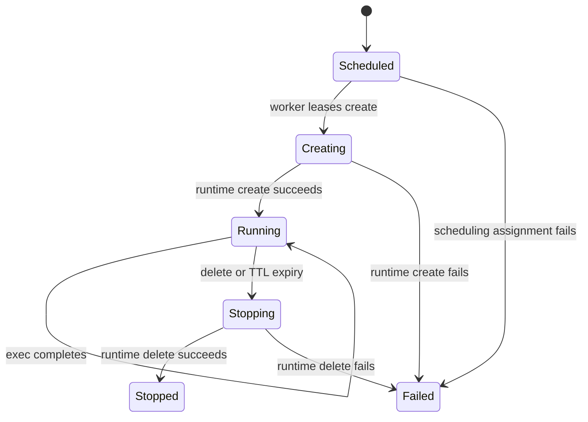

# Architecture

## Goals

Sandbox separates policy from execution while keeping the default service count and memory footprint small. The baseline production topology is one or more stateless controllers, PostgreSQL, and dedicated workers. NATS is optional. Workers never accept operator traffic directly.

## Components

### `sandboxd --role controller`

The controller authenticates requests, validates specs, applies policy, runs AEGIS, records desired state, leases assignments, accepts worker results, emits lifecycle events, and reaps expired sandboxes. It does not hold a Docker socket or execute tenant code.

### `sandboxd --role worker`

The worker registers capacity and isolation capabilities, heartbeats resource availability, leases assignments, serializes operations per sandbox, invokes one runtime adapter, bounds output, and reports results. Its stable node ID is persisted in its state directory.

### `sandbox`

The CLI is a typed API client for humans, automation, and agents. It supports JSON output and synchronous waiting without owning policy.

### `sandbox-mcp`

The MCP server is a newline-delimited JSON-RPC stdio process. It exposes the same operations as schema-defined tools and writes protocol messages only to stdout.

## State transitions

Operations separately move through `pending`, `running`, `succeeded`, or `failed`. Assignment leases expire and can be retried when a worker disappears.

## Storage

PostgreSQL records nodes, sandboxes, operations, and assignments. Domain records are JSONB with indexed routing fields so the API can evolve without a migration for every additive field. Diesel provides typed query construction. The memory backend is for tests and single-process development only.

## Events

The in-memory bus requires no external service. The NATS backend publishes lifecycle envelopes on `sandbox.events`. The database remains the source of truth; event delivery is best-effort in v0.1 and consumers must reconcile from the API.

## Runtime boundary

The built-in Docker adapter applies read-only root filesystems, drops all capabilities, enables `no-new-privileges`, caps CPU/RAM/PIDs, creates bounded tmpfs mounts, and chooses an explicit network. It is appropriate for dedicated worker hosts and trusted tenants.

The external driver protocol lets an organization attach Firecracker, Kata Containers, gVisor, Cloud Hypervisor, Kubernetes, or a private isolation platform without linking that runtime into the control plane. See [runtime-driver.md](runtime-driver.md).

## Failure behavior

- A controller restart recovers desired state from PostgreSQL.
- A worker restart retains its node ID but reconstructs resource accounting as new work arrives; production drivers should expose reconciliation in a future protocol revision.
- An expired assignment lease can be delivered again. Create and delete should be idempotent; exec is at-least-once in v0.1.
- A failed event publish is logged and does not roll back a successful state mutation.
- An unhealthy, draining, overloaded, or stale node is excluded before scoring.

These semantics are intentional and documented so adopters can decide where they need transactional outbox, exactly-once job journaling, or runtime reconciliation before production.
