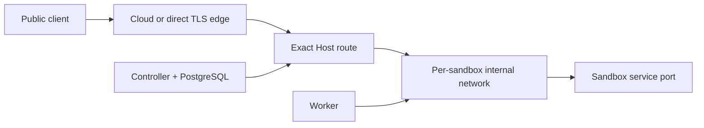
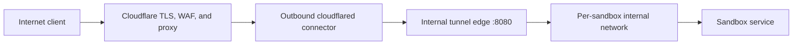

# Public tunnels

Sandbox can publish an HTTP or WebSocket service from a running sandbox at a controller-assigned wildcard hostname. Tunnels are opt-in, asynchronous, persisted with the sandbox, and removed with the tunnel, sandbox deletion, or TTL cleanup.

## What the boundary does

For every sandbox with at least one tunnel, the Docker worker creates a private `--internal` network shared by exactly two containers: that sandbox and the tunnel edge. The edge receives an exact-host dynamic route; it does not use Docker discovery for tenant containers. This prevents a tunnel from silently joining all sandboxes to one shared network.

For a sandbox created with denied networking, the worker temporarily detaches Docker's special `none` network before joining the private tunnel network. Removing the final tunnel restores `none`, preserving denied egress outside the explicitly published service.

The current implementation supports public HTTP and WebSocket services. It deliberately rejects raw TCP and `authenticated = true` until those paths have real enforcement. It also rejects public tunnels for `confidential` or `restricted` workloads.



## DNS

Create a wildcard DNS record for the configured base domain. Use an `A`/`AAAA` record pointed at the edge or a `CNAME` to its public hostname:

```text
*.tunnel.example.com  A  203.0.113.10
```

Set only the base domain in configuration; do not include `*.` or a trailing dot. Subdomains must be lowercase DNS labels. Sandbox generates collision-resistant names when no custom subdomain is requested.

For a full-setup Cloudflare zone, a hostname below `*.tunnel.example.com` is deeper than the first-level subdomains covered by Universal SSL. A proxied deployment therefore needs an Advanced edge certificate containing `*.tunnel.example.com`. Cloudflare Total TLS does not issue certificates for hostnames attached to Cloudflare Tunnel. Without the Advanced certificate, TLS fails at Cloudflare before the request reaches Sandbox.

An orange-cloud `A` record hides the origin from ordinary DNS answers but still leaves a public origin path. For an origin that is not publicly reachable, use the outbound-only Cloudflare Tunnel overlay below and replace the origin-address record with the tunnel-managed `CNAME`.

## Cloudflare Tunnel with a hidden origin

This is the recommended Cloudflare topology. `cloudflared` initiates outbound connections to Cloudflare; neither the controller nor the tunnel edge needs a public listener.



1. In Cloudflare, create one remotely managed tunnel for the Sandbox installation.
2. Add these published application routes to that tunnel:

   | Public hostname | Internal service |
   |---|---|
   | `sandbox.example.com` | `http://controller:8080` |
   | `*.tunnel.example.com` | `http://tunnel-edge:8080` |

   Let Cloudflare create the proxied `CNAME` records to `<tunnel-id>.cfargotunnel.com`. Remove any conflicting origin-address `A`/`AAAA` record only after the connector and replacement routes are ready.
3. If the tunnel hostname is a deeper name such as `*.tunnel.example.com`, order an Advanced edge certificate that explicitly contains that wildcard. A first-level wildcard on a dedicated Cloudflare zone can use Universal SSL instead.
4. Copy only the connector token into a root-readable, gitignored file. Do not pass it on the command line or store it in `.env`:

   ```sh
   install -d -m 0700 deploy/compose/secrets
   umask 077
   read -r -s -p 'Cloudflare tunnel token: ' CLOUDFLARE_CONNECTOR_TOKEN
   printf '\n'
   printf '%s' "$CLOUDFLARE_CONNECTOR_TOKEN" > deploy/compose/secrets/cloudflare-tunnel.token
   unset CLOUDFLARE_CONNECTOR_TOKEN
   ```

5. Start the outbound connector and internal edge:

   ```sh
   export SANDBOX_API_TOKEN="$(openssl rand -hex 32)"
   export SANDBOX_NODE_TOKEN="$(openssl rand -hex 32)"
   export SANDBOX_DOMAIN=sandbox.example.com
   export SANDBOX_PORT=127.0.0.1:8080
   export SANDBOX_TUNNEL_ENABLED=true
   export SANDBOX_TUNNEL_DOMAIN=tunnel.example.com
   export SANDBOX_TUNNEL_ENTRYPOINT=web
   export SANDBOX_TUNNEL_EDGE_TLS=false

   docker compose \
     -f deploy/compose/compose.yaml \
     -f deploy/compose/compose.cloudflare.yaml \
     --profile cloudflare-edge up --build -d
   ```

6. After both public routes pass end-to-end tests, close inbound HTTP, HTTPS, and controller ports at the host and provider firewall. Preserve the management path you actually use. The connector needs outbound TCP or UDP 7844 and HTTPS fallback access.

The overlay pins `cloudflare/cloudflared:2026.7.2`, reads its token with `--token-file`, drops Linux capabilities, uses a read-only filesystem, and publishes no ports. The controller's optional host port binds to loopback when `SANDBOX_PORT` contains a host address, such as `127.0.0.1:8080`.

Cloudflare proxying is not tunnel authentication. Tunnel URLs remain public unless the operator adds an identity-aware Cloudflare Access policy or another supported authentication layer.

## Direct Traefik edge

The Compose `edge` profile exposes Traefik on ports 80 and 443, watches atomically generated route files, and uses ACME HTTP-01. Configure DNS first, then:

```sh
export SANDBOX_API_TOKEN="$(openssl rand -hex 32)"
export SANDBOX_NODE_TOKEN="$(openssl rand -hex 32)"
export SANDBOX_DOMAIN=sandbox.example.com
export SANDBOX_TUNNEL_ENABLED=true
export SANDBOX_TUNNEL_DOMAIN=tunnel.example.com
export SANDBOX_ACME_EMAIL=admin@example.com

docker compose -f deploy/compose/compose.yaml --profile edge up --build -d
```

Traefik's file provider mounts the whole dynamic configuration directory. The worker writes a temporary file and atomically renames it into that directory so the proxy never reads a partial route.

This direct profile publishes the origin on ports 80 and 443. Use the Cloudflare overlay instead when the origin must not accept public ingress.

## Caddy in front

If Caddy already owns ports 80 and 443, keep the internal tunnel edge on port 8080 and let Caddy terminate TLS. Caddy's on-demand TLS `ask` request goes to the controller; the controller returns `204` only for a currently active tunnel hostname and `404` for every other name. The endpoint does not reveal tunnel inventory.

```sh
export SANDBOX_TUNNEL_ENABLED=true
export SANDBOX_TUNNEL_DOMAIN=tunnel.example.com
export SANDBOX_TUNNEL_ENTRYPOINT=web
export SANDBOX_TUNNEL_EDGE_TLS=false

docker compose \
  -f deploy/compose/compose.yaml \
  -f deploy/compose/compose.caddy.yaml \
  --profile caddy-edge up --build -d
```

The reviewed example is [deploy/caddy/Caddyfile.example](../deploy/caddy/Caddyfile.example). Keep real domains, origin addresses, API tokens, and ACME account material in the deployment environment or secret store—not in Git.

## Use it

The service must listen on `0.0.0.0` inside the sandbox. A process bound only to `127.0.0.1` cannot be reached from the private edge network.

Create and publish in one request:

```sh
sandbox create --tenant demo --image python:3.13-alpine --expose 8000
```

Or publish a running sandbox, optionally with a custom subdomain:

```sh
sandbox exec "$SANDBOX_ID" -- sh -c 'python -m http.server 8000 --bind 0.0.0.0 >/tmp/http.log 2>&1 &'
sandbox tunnel create "$SANDBOX_ID" --port 8000
sandbox tunnel create "$SANDBOX_ID" --port 3000 --subdomain review-42
sandbox tunnel list "$SANDBOX_ID"
sandbox tunnel delete "$SANDBOX_ID" "$TUNNEL_ID"
```

MCP clients use `sandbox_tunnel_create` and `sandbox_tunnel_delete`; `sandbox_create.exposures` can publish ports during creation. Treat every returned URL as Internet-facing.

## Configuration

| Key | Default | Meaning |
|---|---:|---|
| `tunnel.enabled` | `false` | Enables controller allocation and worker routing |
| `tunnel.base_domain` | none | Lowercase wildcard base domain without `*.` |
| `tunnel.public_scheme` | `https` | Scheme persisted in returned URLs |
| `tunnel.docker_network_prefix` | `sandbox-tunnel` | Prefix for private per-sandbox networks |
| `tunnel.config_dir` | `/var/lib/sandbox/tunnels` | Worker route directory mounted into the edge |
| `tunnel.edge_container` | `sandbox-tunnel-edge` | Docker container attached to each private network |
| `tunnel.edge_entrypoint` | `websecure` | Traefik entrypoint used by generated routes |
| `tunnel.edge_tls` | `true` | Emit TLS configuration in generated routes |
| `tunnel.edge_cert_resolver` | `letsencrypt` | Optional Traefik certificate resolver |
| `tunnel.max_per_sandbox` | `8` | Per-sandbox limit, between 1 and 32 |

Both controller and workers need the same public domain and scheme. Docker workers additionally need the same route directory, edge container name, entrypoint, and TLS mode as the deployed proxy.

## Failure and cleanup behavior

- A worker advertises tunnel support only when the runtime and tunnel configuration support it; AEGIS will not place an exposure on an incapable node.
- Creation rolls back the runtime sandbox if initial route installation fails.
- Removing the final route disconnects the edge and sandbox and deletes their private network.
- Sandbox delete and TTL reaping remove routes and the private network before removing the container.
- A failed asynchronous tunnel operation is visible on both the operation and tunnel record; inspect it before retrying.

If certificate issuance fails, inspect edge logs, verify wildcard DNS and its proxy mode, and confirm the controller's authorization endpoint returns `204` for the active hostname from inside the edge network. For Cloudflare Tunnel, also confirm the connector is healthy, both published application routes target the internal Compose service names, and the Cloudflare edge certificate covers the exact wildcard depth.
